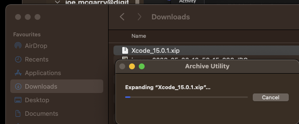
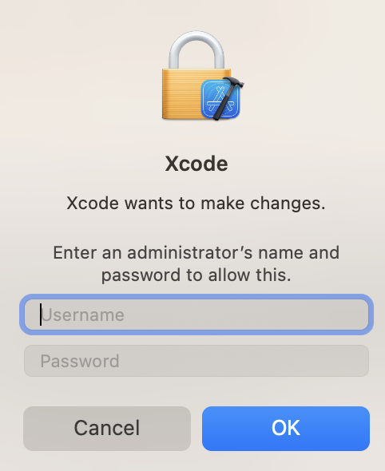
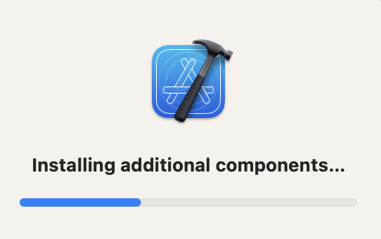

# How To - Required software

## Introduction

This guide shows you how to setup a Mac for iOS development.

You will need a Mac in order to run this. It will not work on a Windows or Linux device.

## Xcode

You'll need an Apple ID in order to download Xcode. Download it using [this link](https://developer.apple.com/download/applications). You will need to become an Apple Developer (you will be prompted to do this, and agree to their terms and conditions) - this is free.

NOTE: We suggest downloading via the link above and not via the App Store to have more control over the Xcode version, due to how the App Store handles version updates with Xcode. 

Select the latest stable version of Xcode (i.e not a beta release), then click `Download Xcode XX.X.X (X.XXGB)` to download a compressed file:

Select a location to save the file:

Once Xcode has downloaded, go to the folder where you saved the download (`Downloads` by default) and double click on `Xcode_XX.X.XX.xip` to extract the contents from the compressed file:

Once complete, you can launch Xcode from that location, however you can move it to the Applications if you desire by dragging Xcode to Applications (on the left hand side of Finder), however this may require Administrator permission:

When launching Xcode for the first time, you might be prompted to enter the administrator's name and password to continue:

You'll need to accept the terms and conditions that Apple present in order for Xcode to run:

A dialog will be presented showing which additional simulators and SDKs you want to install. Check the box for iOS (watchOS and tvOS can remain unchecked): 

Xcode will download and install the additional iOS SDK:

Your Xcode installation and setup is now complete. Depending on your internet speeds, the iOS SDK might be downloading still. Either way, the Xcode welcome screen should be showing, along with the `What's New in Xcode` screen:

 
 

