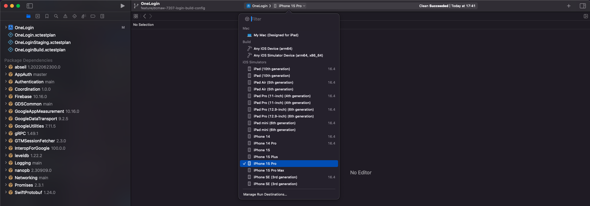
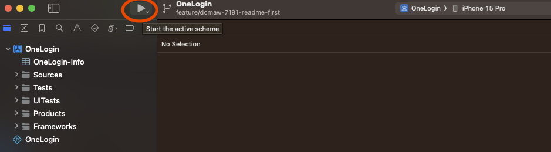
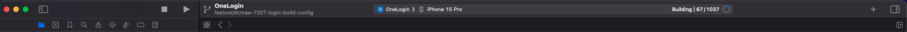
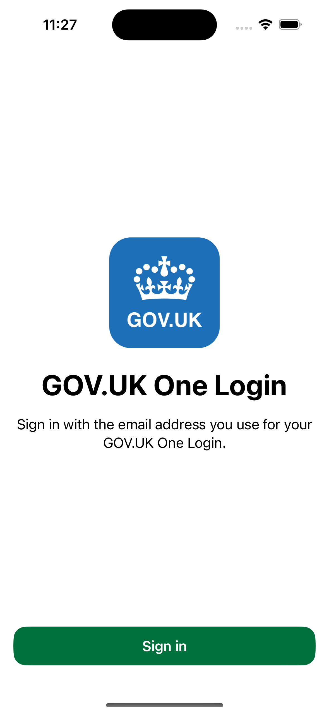
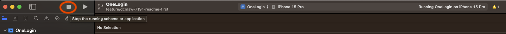

# How to Run the Code

## Introduction

This guide shows you how to setup an Android Virtual Device (AVD) and run the application from Xcode.

_Note:_ It is assumed that you have already cloned the git repo to a suitable working directory.

## Selecting an iOS device

At the top of the toolbar in Xcode, next to OneLogin click the device (it might default to `My Mac`) and select an iOS device (iPhone 15, iPhone SE etc)

 

## Running the app

From the top toolbar in Xcode, click the play button found in the left hand side of the toolbar:

 

Xcode will build the app, install it onto our iOS simulator and then run it for us:

 

Once the task has finished, you should see the landing screen of the app in the iOS simulator:

To stop the simulator from running the app, you can click the stop button found to the left of the play button:

 

