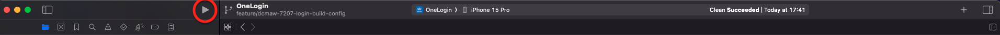

# How to Run the Code

## Introduction

This guide shows you how to select a scheme, simulator and run the application from Xcode.

## Set up

In order to build and run the app, ensure that the following repositories have been cloned  into a suitable working directory:
- https://github.com/govuk-one-login/mobile-ios-one-login-app
- https://github.com/govuk-one-login/mobile-id-check-ios-sdk

You will also need a Firebase token to get around the app check restrictions, and configure your machine to use ReadID SPM locally. Instructions on how to do this can be found [here](https://govukverify.atlassian.net/wiki/spaces/DCMAW/pages/5412028666/iOS+Local+Development+Environment+Setup+Documentation#3.-Get-the-encrypted-credentials-required-for-Firebase-and-ReadID)

## Selecting an iOS device

At the top of the toolbar in Xcode, select a scheme to run your app in (options are "OneLoginRelease" for a Release configuration, "OneLoginIntegration" for a Integration configuration, "OneLoginStaging" for a Staging configuration and "OneLoginBuild" for a Build configuration), click the device (it might default to `My Mac`) and select an iOS device (iPhone 15, iPhone SE etc)

_Note:_Minimum iOS support: iOS 15

## Running the app

From the top toolbar in Xcode, click the play button found on the left hand side of the toolbar:

Xcode will build the app, install it onto the iOS simulator and then run it:

Once the task has finished, you should see the landing screen of the app in the iOS simulator:

To stop the simulator from running the app, you can click the stop button found to the left of the play button:

 

## Running a full ID Check journey

Details on how to run a full ID Check journey within the app can be found [here](https://govukverify.atlassian.net/wiki/spaces/DCMAW/pages/5332238340/Run+a+V2+Identity+Proving+Journey). Currently, it is not possible to run this journey in an environment lower than Staging. Therefore, the simulator cannot be used for this due to app attest restrictions.
