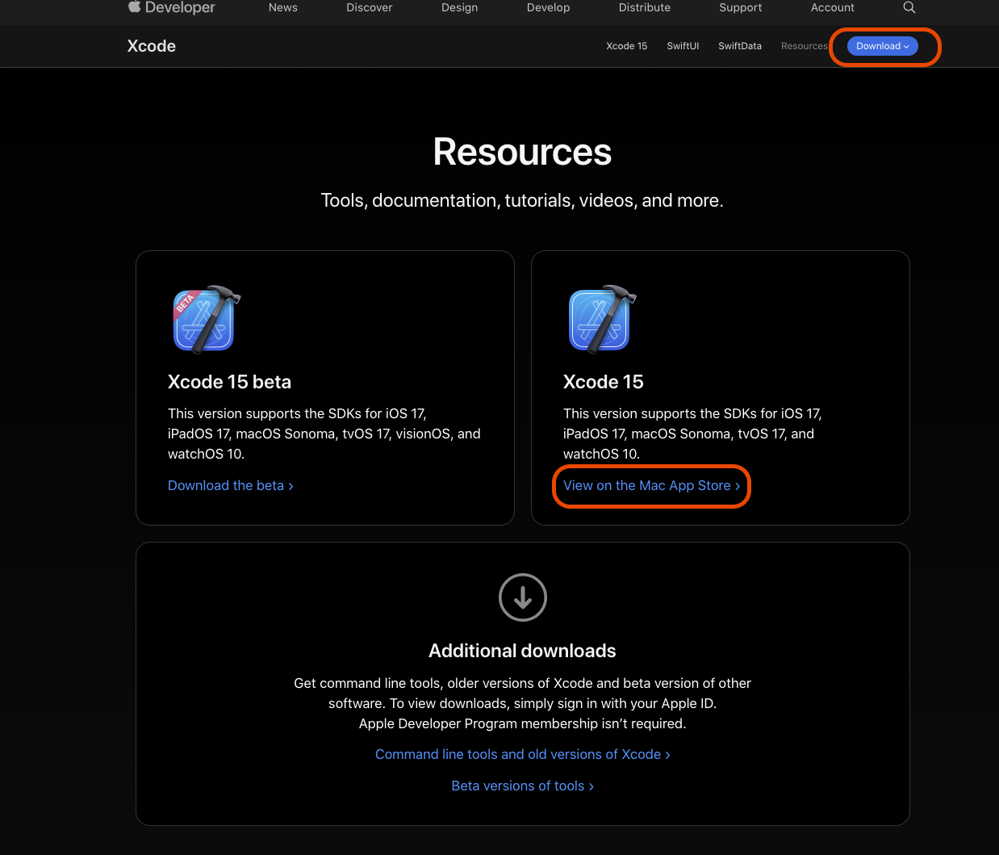
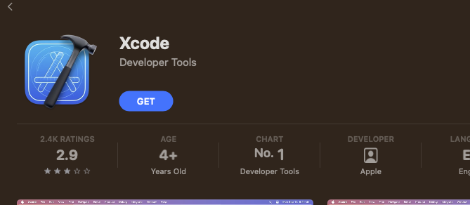
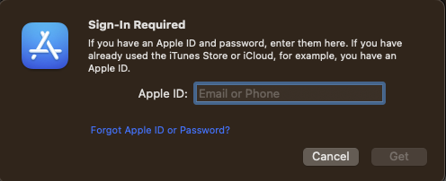
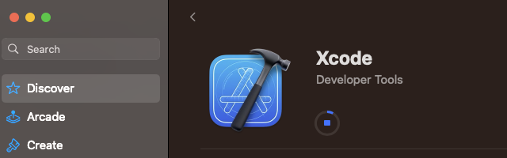
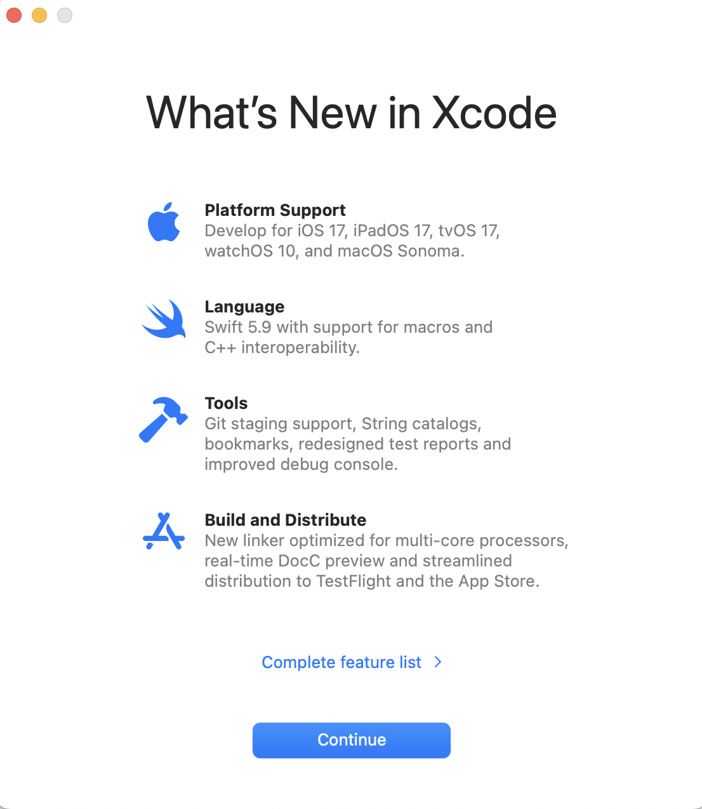

# How To - Required software

## Introduction

This guide shows you how to setup a Mac for iOS development.

You will need a Mac in order to run this. It will not work on a Windows or Linux device.

## Xcode

You'll need an Apple ID in order to download Xcode. Download it either through the [Mac App Store](https://apps.apple.com/gb/app/xcode/id497799835?mt=12) using this link. Or, if you're on the Apple Developer Program you can download separately through [this link](https://developer.apple.com/download/)).

For the App Store download route, select the latest stable version of Xcode (i.e Xcode 15, not the Beta version), either by clicking `View on the Mac App Store` or `Xcode 15` on the blue `Download` button in the top right of the screen.

If a browser pop-up appears asking to open the App Store, click on `Open App Store` to be redirected. Or, manually search for Xcode in the App Store.

Click on the blue `Get` button, and then the green `Install` button

You may need to signin to your Apple ID. If asked to, signin using your Apple ID credentials.

Wait patiently for Xcode to download

Once Xcode has downloaded, go to the Applications folder and launch Xcode.

You might be prompted to enter the administrator's name and password to continue with Xcode's installation

You'll need to accept the terms and conditions that Apple present in order for Xcode to run.

A dialog will be presented showing which simulators additional simulators and SDKs you want to install. Check the box for iOS, watchOS and tvOS can remain unchecked. 

Xcode will download and install the additional iOS SDK

Your Xcode installation and setup is now complete. Depending on your internet speeds, the iOS SDK might be downloading still. Either way, this screen should be showing, along with the `What's New in Xcode` screen.

 
 

